# PROJECT 4: MEAN STACK IMPLEMENTATION

MEAN STACK DEPLOYMENT TO UBUNTU IN AWS

Step 0:  Preparing prerequisites

- Sign in to AWS free tier account and create a new EC2 Instance of t2.nano family with Ubuntu Server 20.04 LTS or 22.04 LTS, (HVM) image.
  
- Connect to this instance via SSH.

Task:

In this assignment you are going to implement a simple Book Register web form using MEAN stack.

Step 1: Install NodeJs

Update ubuntu

`sudo apt update`

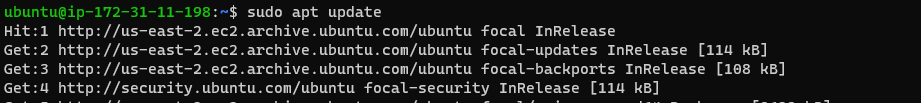

Upgrade ubuntu

`sudo apt upgrade`

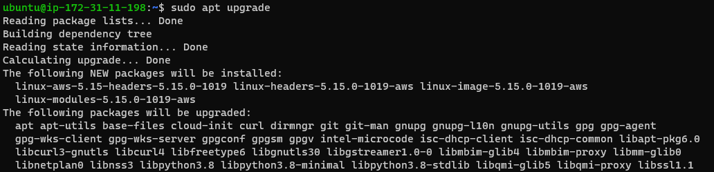

Add certificates:

`sudo apt -y install curl dirmngr apt-transport-https lsb-release ca-certificates`

`curl -sL https://deb.nodesource.com/setup_18.x | sudo -E bash -`

Install NodeJS:

`sudo apt install -y nodejs`

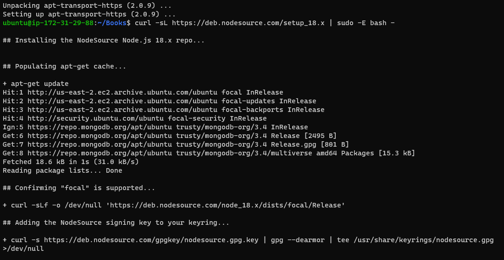

Step 2: Install MongoDB

`sudo apt-key adv --keyserver hkp://keyserver.ubuntu.com:80 --recv 0C49F3730359A14518585931BC711F9BA15703C6`

`echo "deb [ arch=amd64 ] https://repo.mongodb.org/apt/ubuntu trusty/mongodb-org/3.4 multiverse" | sudo tee /etc/apt/sources.list.d/mongodb-org-3.4.list`

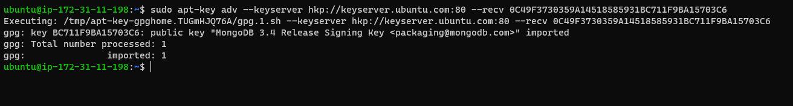

`sudo apt install -y mongodb`

Start The server:

`sudo service mongodb start`

Verify that the service is up and running:

`sudo systemctl status mongodb`

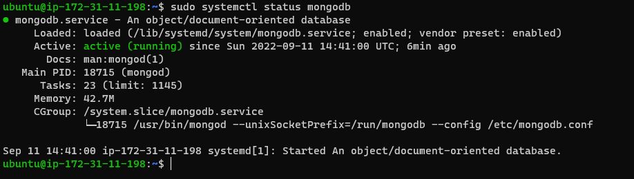

Install npm – Node package manager:

`sudo apt install -y npm`

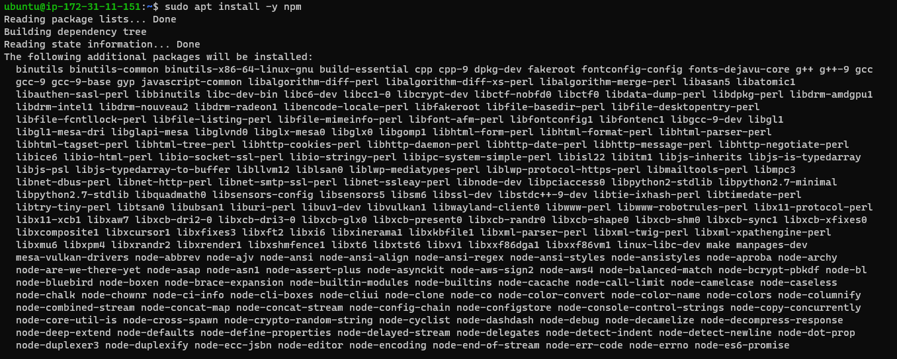

Install body-parser package:

`sudo npm install body-parser`

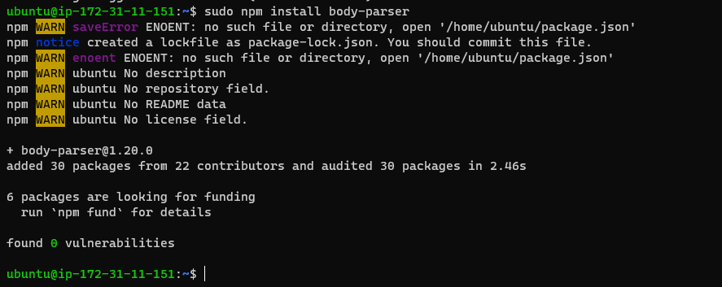

Create a folder named ‘Books’

`mkdir Books && cd Books`

In the Books directory, Initialize npm project:

`npm init`

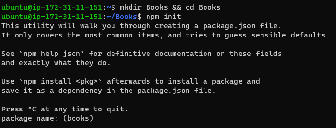

Add a file to it named server.js

`vi server.js`

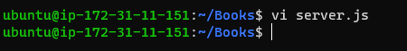

Edit the file

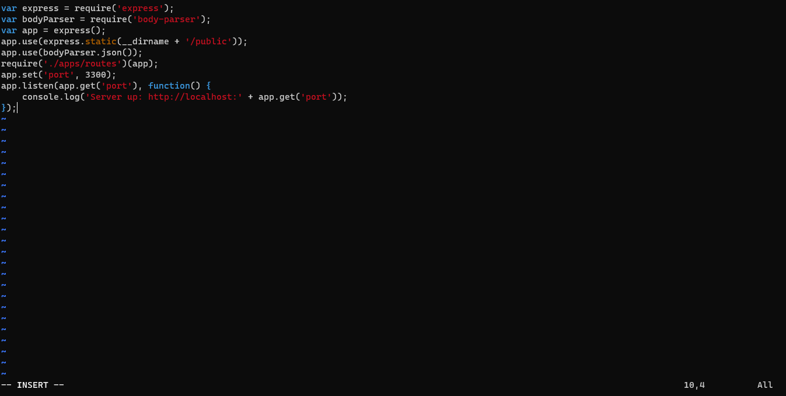

Step 3: Install Express and set up routes to the server

Install express and mongoose in Books folder

`sudo npm install express mongoose`

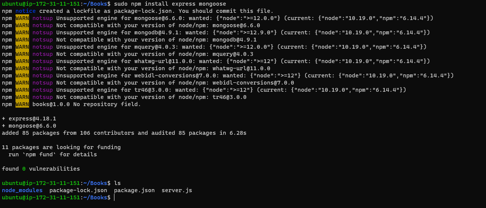

Create a folder named apps in the Books folder

`mkdir apps && cd apps`

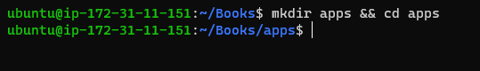

Create a "routes.js" file in apps folder

`vi routes.js`

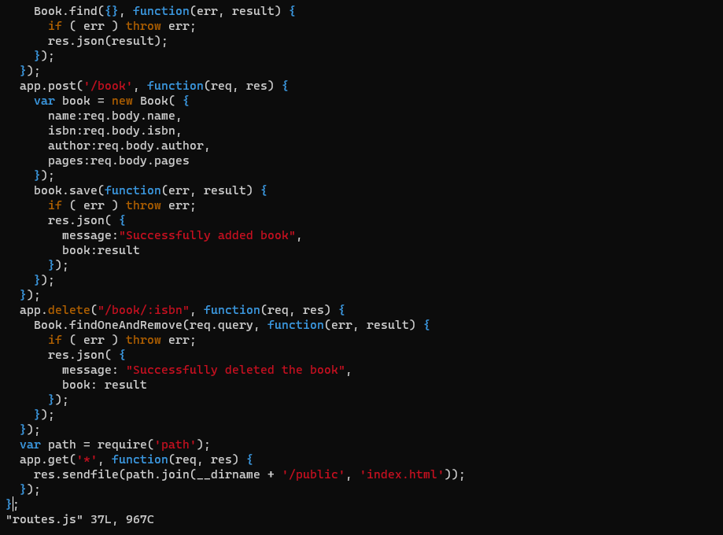

Create a folder named models in the "apps" folder

`mkdir models && cd models`

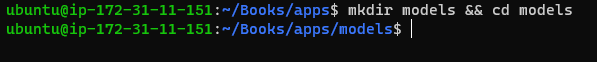

Create a file named book.js

`vi book.js`

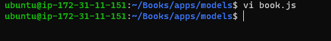

Input the script

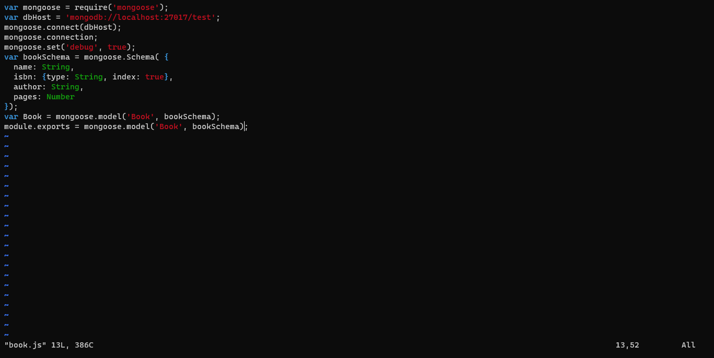

Step 4 – Access the routes with AngularJS

Change the directory back to ‘Books’

`cd ../..`

Create a folder 'public' in Books

`mkdir public && cd public`

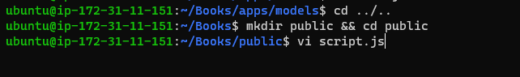

Add a file named script.js

`vi script.js`

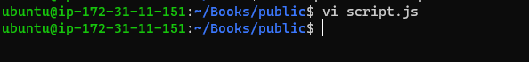

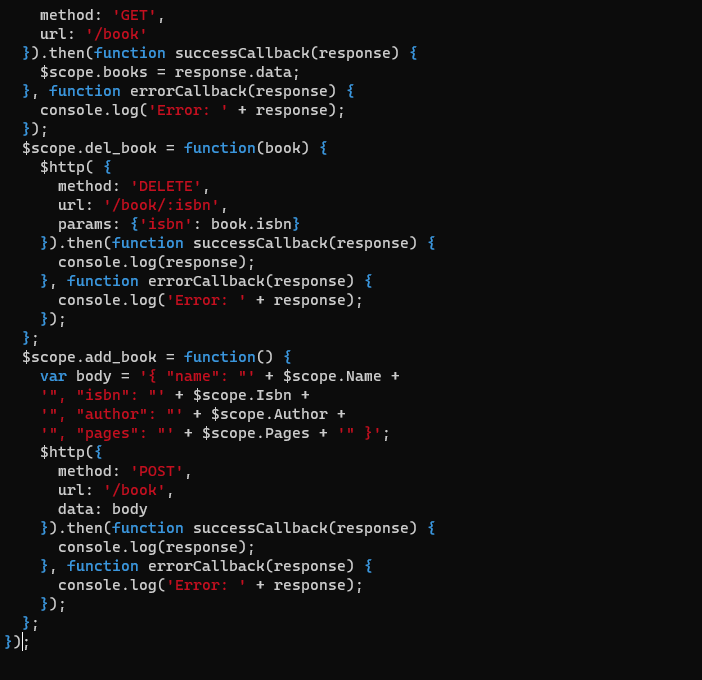

Create a file named index.html in public folder

`vi index.html`

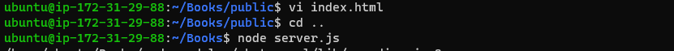

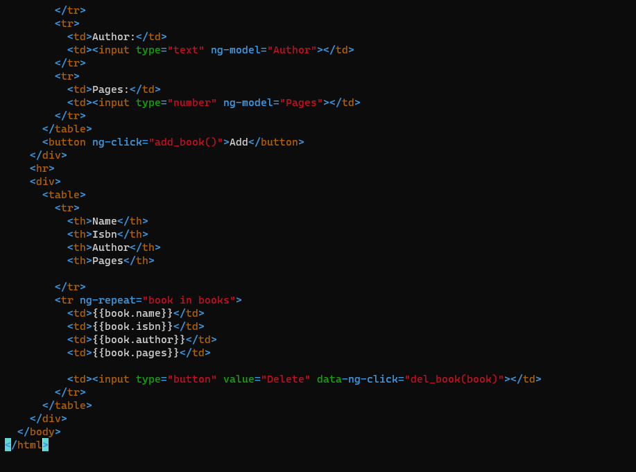

Change the directory back up to Books

`cd ..`

Start the server

`node server.js`

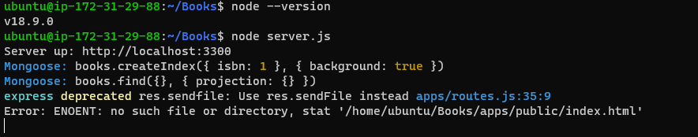

The server is now up and running

Connect it via port 3300

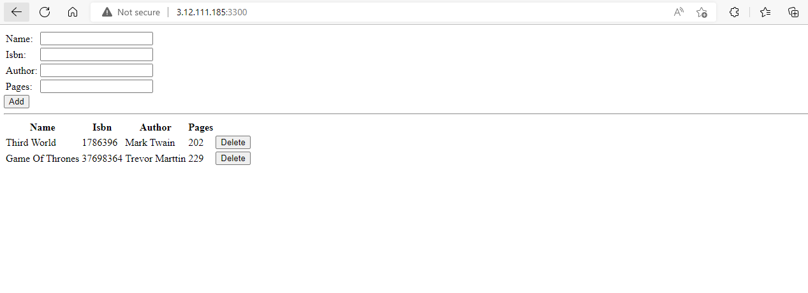
